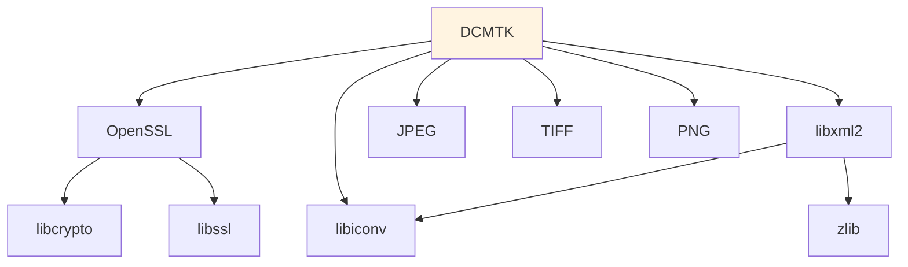

DCMTK (DICOM Toolkit) is the core medical imaging library that provides all DICOM functionality. It's developed by OFFIS in Germany and is the de-facto standard for DICOM implementations.

## What is DCMTK?

DCMTK is a comprehensive collection of libraries and tools for:

- **DICOM File Operations**: Reading, writing, and parsing DICOM files
- **Network Communication**: Implementing DICOM network protocols (C-STORE, C-FIND, C-MOVE, C-GET)
- **Data Manipulation**: Converting, modifying, and validating DICOM data
- **Image Compression**: Supporting various DICOM compression formats

<Info>
DICOM (Digital Imaging and Communications in Medicine) is the international standard for medical images and related information. DCMTK makes it possible to work with files from CT scanners, MRI machines, and other medical imaging devices.
</Info>

## Version Information

Miele-LXIV Easy uses DCMTK with the following configuration:

<CodeGroup>
```bash Version (from version-set-8.8.conf)
DCMTK_MAJOR=3
DCMTK_MINOR=6
DCMTK_BUILD=5
DCMTK_VERSION=3.6.5
```

```bash Download Location
https://dicom.offis.de/download/dcmtk/dcmtk365/dcmtk-3.6.5.tar.gz
```
</CodeGroup>

## Build Configuration

DCMTK is configured with several important options:

```bash build.sh:546-569
$CMAKE -G"$GENERATOR" \
    -D CMAKE_INSTALL_PREFIX=$BIN_DCMTK \
    -D CMAKE_OSX_ARCHITECTURES=$OSX_ARCHITECTURES \
    -D CMAKE_BUILD_TYPE=Release \
    -D CMAKE_OSX_DEPLOYMENT_TARGET=$DEPL_TARG \
    -D CMAKE_CXX_FLAGS="-D $DCMTK_CXX_FLAGS" \
    -D BUILD_SHARED_LIBS=OFF \
    $DCMTK_OPTIONS \
    -D JPEG_INCLUDE_DIR=$BIN_JPEG/include \
    -D JPEG_LIBRARY_RELEASE=$BIN_JPEG/lib/libjpeg.a \
    -D LIBCHARSET_INCLUDE_DIR=$BIN_ICONV/include \
    -D LIBCHARSET_LIBRARY=$BIN_ICONV/lib/libcharset.a \
    -D Iconv_INCLUDE_DIR=$BIN_ICONV/include \
    -D Iconv_LIBRARY=$BIN_ICONV/lib/libiconv.a \
    -D WITH_OPENSSLINC=ON \
    -D OPENSSL_VERSION_CHECK=ON \
    -D OPENSSL_INCLUDE_DIR=$BIN_OPENSSL/include \
    -D OPENSSL_CRYPTO_LIBRARY=$BIN_OPENSSL/lib/libcrypto.a \
    -D OPENSSL_SSL_LIBRARY=$BIN_OPENSSL/lib/libssl.a \
    $SRC_DCMTK
```

### Key Configuration Options

| Option | Purpose |
|--------|--------|
| `BUILD_SHARED_LIBS=OFF` | Build static libraries for easier distribution |
| `DCMTK_WITH_OPENSSL=ON` | Enable secure DICOM network communication |
| `DCMTK_WITH_ICONV=ON` | Support international character sets |
| `FOR_MIELE_LXIV` | Custom flag for Miele-specific code paths |

## Patching Process

DCMTK requires patches for compatibility with Miele-LXIV Easy. The patches are stored in the `patch/` directory:

```bash
patch/dcmtk-3.6.5_miele-easy-8.4.62.patch
```

<Warning>
**Critical**: The DCMTK patch contains essential modifications for:
- macOS compatibility fixes
- Custom network behavior for Miele-LXIV
- Integration points with the application

Never skip the patching step when building DCMTK.
</Warning>

### Applying Patches

The build script automatically applies patches:

```bash build.sh:533-538
if [ $STEP_PATCH_DCMTK ] && [ -f $PATCH_DIR/$PATCH_FILENAME ] ; then
cd $SRC_DCMTK
echo "=== Patch DCMTK"
patch -p1 -i $PATCH_DIR/$PATCH_FILENAME
fi
```

## DCMTK Components

DCMTK consists of multiple modules, each providing specific functionality:

### Core Modules

- **dcmdata**: Core data structures for DICOM objects
- **dcmnet**: DICOM network protocol implementation
- **dcmimgle**: Image handling and manipulation
- **dcmimage**: Support for color images

### Compression Modules

- **dcmjpeg**: JPEG compression (uses libjpeg)
- **dcmjpls**: JPEG-LS lossless compression

### Network Services

- **dcmqrdb**: Query/Retrieve database
- **dcmpstat**: Presentation states
- **dcmtls**: TLS/SSL secure transport

<Info>
All DCMTK modules are compiled and then collapsed into a single `libDCMTK.a` static library for easier linking.
</Info>

## Dependencies

DCMTK depends on several other libraries:



## Post-Installation Processing

After installation, additional headers are copied for Miele-LXIV compatibility:

```bash build.sh:591-602
echo "=== Post-install DCMTK"
cp -R $SRC_DCMTK/dcmjpeg/libijg8 $BIN_DCMTK/include/dcmtk/dcmjpeg
cp -R $SRC_DCMTK/dcmjpeg/libijg12 $BIN_DCMTK/include/dcmtk/dcmjpeg
cp -R $SRC_DCMTK/dcmjpeg/libijg16 $BIN_DCMTK/include/dcmtk/dcmjpeg
cp $SRC_DCMTK/dcmjpls/libcharls/intrface.h $BIN_DCMTK/include/dcmtk/dcmjpls
cp $SRC_DCMTK/dcmjpls/libcharls/pubtypes.h $BIN_DCMTK/include/dcmtk/dcmjpls
```

These headers provide access to:
- **libijg8/12/16**: Internal JPEG libraries with different bit depths
- **libcharls**: JPEG-LS compression headers

## Library Collapsing

DCMTK produces many individual libraries (one per module). The build system collapses them into a single archive:

```bash build.sh:620-629
if [ $STEP_COLLAPSE_DCMTK ] ; then
cd $BIN_DCMTK
DCMTK_COLLAPSED=lib/libDCMTK.a
if [ ! -f $DCMTK_COLLAPSED ] ; then
    echo "=== Collapse DCMTK into a single library"
    ARGS=$(find lib -name '*.a' -type f)
    libtool -static -v -o $DCMTK_COLLAPSED $ARGS
fi
fi
```

This combines all DCMTK modules into `libDCMTK.a`, simplifying the link phase in Xcode.

## Configuration in Kconfig

The Kconfig system allows selective building of DCMTK:

```kconfig Kconfig-miele:49-56
config DOWNLOAD_SOURCES_DCMTK
    bool "DCMTK"
    default y
    
config PATCH_DCMTK
    bool "patch DCMTK"
    default y
    depends on DOWNLOAD_SOURCES_DCMTK
```

## Common Build Issues

### OpenSSL Compatibility

If you encounter `_EVP_PKEY_get_bits` errors, you may need to switch OpenSSL versions:

```bash
brew unlink openssl@3
brew link openssl@1.1
# Build DCMTK
brew unlink openssl@1.1
brew link openssl@3
```

<Note>
This is only necessary on systems with multiple OpenSSL versions installed. The build script includes commented-out code for this workaround at build.sh:577-582.
</Note>

## Integration with Miele-LXIV

DCMTK is used throughout Miele-LXIV for:

1. **Loading DICOM Files**: Reading patient images from disk or network
2. **Network Operations**: Querying PACS servers and retrieving images
3. **Data Export**: Saving modified images in DICOM format
4. **Compression**: Supporting various DICOM transfer syntaxes

## Further Reading

<CardGroup cols={2}>
  <Card title="DCMTK Official Site" icon="globe" href="https://dicom.offis.de/dcmtk">
    Complete DCMTK documentation and resources
  </Card>
  
  <Card title="DICOM Standard" icon="book" href="https://www.dicomstandard.org/">
    Learn about the DICOM standard
  </Card>
</CardGroup>
