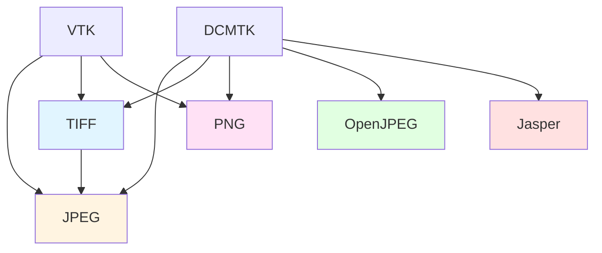

Medical imaging uses various compression formats to balance image quality with file size. Miele-LXIV Easy integrates multiple image format libraries to support the full range of DICOM transfer syntaxes and display formats.

## Overview

The build system compiles five major image format libraries:

<CardGroup cols={2}>
  <Card title="JPEG" icon="file-image">
    Standard lossy compression (JPEG baseline)
  </Card>
  
  <Card title="TIFF" icon="file-lines">
    Multi-page image storage and lossless compression
  </Card>
  
  <Card title="PNG" icon="image">
    Lossless compression for screenshots and displays
  </Card>
  
  <Card title="OpenJPEG" icon="file-zipper">
    JPEG 2000 compression (lossy and lossless)
  </Card>
  
  <Card title="Jasper" icon="gem">
    Alternative JPEG 2000 implementation
  </Card>
</CardGroup>

## JPEG (libjpeg)

### Purpose

The Independent JPEG Group's library handles standard JPEG compression. In medical imaging, JPEG is used for:

- **DICOM Transfer Syntax 1.2.840.10008.1.2.4.50**: JPEG Baseline (lossy)
- **Preview Images**: Thumbnails and quick previews
- **Screen Captures**: Exporting views for reports

<Warning>
Lossy JPEG should not be used for diagnostic images where image quality is critical. Many institutions only allow lossless compression for primary diagnostic images.
</Warning>

### Version & Configuration

<CodeGroup>
```bash Version (from version-set-8.8.conf)
JPEG_VERSION=9d
```

```bash Download
curl -O http://www.ijg.org/files/jpegsrc.v9d.tar.gz
```

```bash Build Configuration (build.sh:327-331)
$SRC_JPEG/configure \
    --prefix=$BIN_JPEG
```
</CodeGroup>

### Build Process

JPEG uses a traditional autotools build:

```bash build.sh:314-340
if [ $STEP_DOWNLOAD_LIB_JPEG ] && [ ! -d $SRC_JPEG ] ; then
cd $SRC
curl -O http://www.ijg.org/files/jpegsrc.v$JPEG_VERSION.tar.gz
tar -zxf jpegsrc.v$JPEG_VERSION.tar.gz
rm jpegsrc.v$JPEG_VERSION.tar.gz
fi

if [ $STEP_CONFIGURE_LIB_JPEG ] ; then
echo "=== Configure LIBJPEG in $BLD_JPEG"
mkdir -p $BLD_JPEG ; cd $BLD_JPEG
$SRC_JPEG/configure --prefix=$BIN_JPEG
fi

if [ $STEP_COMPILE_LIB_JPEG ] ; then
cd $BLD_JPEG
echo "=== Build LIBJPEG"
make $MAKE_FLAGS
echo "=== Install LIBJPEG"
make install
fi
```

## TIFF (libtiff)

### Purpose

TIFF (Tagged Image File Format) provides:

- **Multi-page Storage**: Multiple images in one file
- **Lossless Compression**: LZW, ZIP compression
- **Metadata**: Rich tagging system
- **High Bit Depths**: 12-bit, 16-bit images

TIFF is used for exporting image series and archival storage.

### Version & Configuration

<CodeGroup>
```bash Version (from version-set-8.8.conf)
TIFF_VERSION=4.0.10
```

```bash Download
wget http://download.osgeo.org/libtiff/tiff-4.0.10.tar.gz
```
</CodeGroup>

### Build Configuration

TIFF is built with CMake and depends on JPEG:

```bash build.sh:355-373
$CMAKE -G"$GENERATOR" \
    -D CMAKE_INSTALL_PREFIX=$BIN_TIFF \
    -D CMAKE_OSX_ARCHITECTURES=$OSX_ARCHITECTURES \
    -D CMAKE_BUILD_TYPE=Release \
    -D CMAKE_OSX_DEPLOYMENT_TARGET=$DEPL_TARG \
    -D BUILD_SHARED_LIBS=OFF \
    -D BUILD_DOCUMENTATION=OFF \
    -D BUILD_TESTING=OFF \
    -D lzma=OFF \
    -D zstd=OFF \
    -D webp=OFF \
    -D JPEG_INCLUDE_DIR=$BIN_JPEG/include \
    -D JPEG_LIBRARY=$BIN_JPEG/lib/libjpeg.a \
    -D CMAKE_CXX_FLAGS="$COMPILER_FLAGS" \
    $SRC_TIFF
```

### Post-Install Patching

TIFF headers are patched to avoid type conflicts:

```bash build.sh:383-386
sed -i '' -e "s/typedef TIFF_UINT64_T/\/\/typedef TIFF_UINT64_T/g" "$BIN_TIFF/include/tiff.h"
sed -i '' -e "s/uint64 tiff_diroff/TIFF_UINT64_T tiff_diroff/g" "$BIN_TIFF/include/tiff.h"
sed -i '' -e "s/uint64/TIFF_UINT64_T/g" "$BIN_TIFF/include/tiffio.h"
```

These modifications prevent type collisions on macOS.

## PNG (libpng)

### Purpose

PNG (Portable Network Graphics) provides lossless compression for:

- **Screen Captures**: Export visualizations
- **Overlays**: Annotations and graphics
- **Web Display**: Share images online

PNG is not used for primary DICOM storage but for display and export.

### Version & Configuration

<CodeGroup>
```bash Version (from version-set-8.8.conf)
PNG_VERSION=1.6.37
```

```bash Download
curl -O https://dicom.offis.de/download/dcmtk/dcmtk365/support/libpng-1.6.37.tar.gz
```
</CodeGroup>

### Build Configuration

```bash build.sh:207-219
$CMAKE -G"$GENERATOR" \
    -D CMAKE_INSTALL_PREFIX=$BIN_PNG \
    -D CMAKE_OSX_ARCHITECTURES=$OSX_ARCHITECTURES \
    -D CMAKE_BUILD_TYPE=Release \
    -D CMAKE_OSX_DEPLOYMENT_TARGET=$DEPL_TARG \
    -D PNG_FRAMEWORK=ON \
    -D BUILD_SHARED_LIBS=ON \
    -D CMAKE_CXX_FLAGS="$COMPILER_FLAGS" \
    $SRC_PNG
```

<Note>
PNG is built as a shared library (BUILD_SHARED_LIBS=ON) and framework, unlike most other dependencies which use static linking.
</Note>

## OpenJPEG

### Purpose

OpenJPEG is an open-source JPEG 2000 codec supporting:

- **JPEG 2000 Compression**: Both lossy and lossless
- **High Bit Depths**: 12-bit, 16-bit medical images
- **Better Quality**: Superior to JPEG at same compression ratios
- **DICOM Transfer Syntaxes**: Multiple J2K variants

JPEG 2000 is increasingly popular in medical imaging for its quality and flexibility.

### Version & Configuration

<CodeGroup>
```bash Version (from version-set-8.8.conf)
OPENJPG_MAJOR=2
OPENJPG_MINOR=3
OPENJPG_BUILD=1
OPENJPG_VERSION=2.3.1
```

```bash Download
wget https://github.com/uclouvain/openjpeg/archive/v2.3.1.tar.gz
```
</CodeGroup>

### Build Configuration

```bash build.sh:658-670
$CMAKE -G"$GENERATOR" \
    -D CMAKE_INSTALL_PREFIX=$BIN_OPENJPG \
    -D CMAKE_OSX_ARCHITECTURES=$OSX_ARCHITECTURES \
    -D CMAKE_BUILD_TYPE=Release \
    -D CMAKE_OSX_DEPLOYMENT_TARGET=$DEPL_TARG \
    -D CMAKE_EXPORT_COMPILE_COMMANDS=ON \
    -D BUILD_SHARED_LIBS=OFF \
    -D BUILD_THIRDPARTY=ON \
    -D CMAKE_CXX_FLAGS="$COMPILER_FLAGS" \
    $SRC_OPENJPG
```

### Patching

OpenJPEG requires patches for compatibility:

```bash
patch/openjpeg-2.3.1_miele-easy-8.4.62.patch
```

```bash build.sh:644-650
if [ $STEP_PATCH_OPENJPG ] ; then
cd $SRC_OPENJPG
echo "=== Patch OpenJPEG"
if [ -f $PATCH_DIR/$PATCH_FILENAME ] ; then
patch -p1 -i $PATCH_DIR/$PATCH_FILENAME
fi
fi
```

### Post-Install

Additional headers are copied after installation:

```bash build.sh:684
cp $SRC_OPENJPG/src/bin/common/format_defs.h $BIN_OPENJPG/include
```

## Jasper

### Purpose

Jasper is an alternative JPEG 2000 implementation. Miele-LXIV includes both OpenJPEG and Jasper for maximum compatibility with different JPEG 2000 variants.

### Version & Configuration

<CodeGroup>
```bash Version (from version-set-8.8.conf)
JASPER_VERSION=2.0.32
```

```bash Download
wget https://github.com/jasper-software/jasper/releases/download/version-2.0.32/jasper.tar.gz
```
</CodeGroup>

### Build Configuration

```bash build.sh:699-712
$CMAKE -G"$GENERATOR" \
    -D CMAKE_INSTALL_PREFIX=$BIN_JASPER \
    -D CMAKE_OSX_ARCHITECTURES=$OSX_ARCHITECTURES \
    -D CMAKE_BUILD_TYPE=Release \
    -D CMAKE_OSX_DEPLOYMENT_TARGET=$DEPL_TARG \
    -D CMAKE_EXPORT_COMPILE_COMMANDS=ON \
    -D CMAKE_CXX_FLAGS="$COMPILER_FLAGS" \
    -D JAS_ENABLE_AUTOMATIC_DEPENDENCIES=OFF \
    -D JAS_ENABLE_SHARED=OFF \
    -D JAS_ENABLE_PROGRAMS=OFF \
    $SRC_JASPER
```

| Option | Purpose |
|--------|--------|
| `JAS_ENABLE_SHARED=OFF` | Build static library |
| `JAS_ENABLE_PROGRAMS=OFF` | Don't build command-line tools |
| `JAS_ENABLE_AUTOMATIC_DEPENDENCIES=OFF` | Manage dependencies manually |

## Library Dependencies

The image libraries have interdependencies:



## DICOM Transfer Syntax Support

These libraries enable support for DICOM transfer syntaxes:

| Transfer Syntax | Library | Description |
|----------------|---------|-------------|
| 1.2.840.10008.1.2.4.50 | JPEG | JPEG Baseline (lossy, 8-bit) |
| 1.2.840.10008.1.2.4.51 | JPEG | JPEG Extended (lossy, 12-bit) |
| 1.2.840.10008.1.2.4.57 | JPEG | JPEG Lossless, Non-Hierarchical |
| 1.2.840.10008.1.2.4.70 | JPEG | JPEG Lossless, First-Order Prediction |
| 1.2.840.10008.1.2.4.80 | OpenJPEG/Jasper | JPEG-LS Lossless |
| 1.2.840.10008.1.2.4.90 | OpenJPEG/Jasper | JPEG 2000 Lossless |
| 1.2.840.10008.1.2.4.91 | OpenJPEG/Jasper | JPEG 2000 Lossy |

<Info>
DCMTK automatically uses the appropriate library based on the transfer syntax of the DICOM file being loaded.
</Info>

## Configuration in Kconfig

```kconfig Kconfig-miele:34-39
config DOWNLOAD_LIB_JPEG
    bool "lib jpeg"
    default y

config DOWNLOAD_LIB_TIFF
    bool "lib tiff"
    default y

config DOWNLOAD_LIB_PNG
    bool "lib png"
    default y

config DOWNLOAD_SOURCES_OPENJPG
    bool "OpenJPEG"
    default y

config DOWNLOAD_SOURCES_JASPER
    bool "Jasper"
    default y
```

## Build Order

The image libraries must be built in this order due to dependencies:

1. **JPEG** (no dependencies)
2. **PNG** (no dependencies)
3. **TIFF** (depends on JPEG)
4. **OpenJPEG** (no dependencies)
5. **Jasper** (no dependencies)
6. **VTK** (uses JPEG, TIFF, PNG)
7. **DCMTK** (uses all image libraries)

The build script handles this ordering automatically.

## Common Issues

### TIFF Type Conflicts

If you see errors about `uint64` type conflicts, ensure the post-install patching step ran:

```bash
# This should be automatic, but can be run manually:
sed -i '' -e "s/uint64/TIFF_UINT64_T/g" "$BIN_TIFF/include/tiffio.h"
```

### OpenJPEG Linking

Ensure the format_defs.h header was copied:

```bash
ls $BIN_OPENJPG/include/format_defs.h
```

If missing, copy it manually from build.sh:684.

## Further Reading

<CardGroup cols={2}>
  <Card title="libjpeg" icon="globe" href="http://www.ijg.org/">
    Independent JPEG Group homepage
  </Card>
  
  <Card title="libtiff" icon="globe" href="http://www.libtiff.org/">
    LibTIFF documentation
  </Card>
  
  <Card title="OpenJPEG" icon="github" href="https://github.com/uclouvain/openjpeg">
    OpenJPEG GitHub repository
  </Card>
  
  <Card title="JPEG 2000 Standard" icon="book" href="https://jpeg.org/jpeg2000/">
    JPEG 2000 specifications
  </Card>
</CardGroup>
