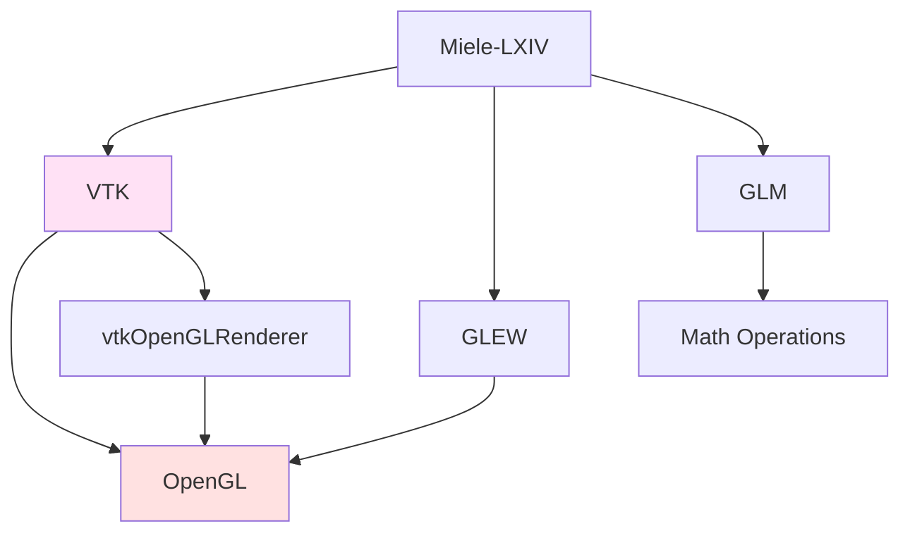
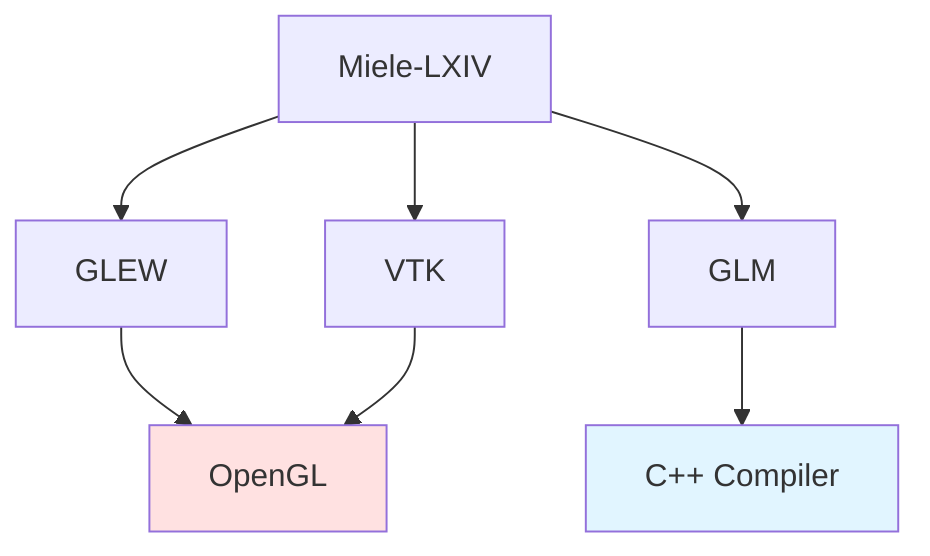

Modern medical imaging applications leverage GPU hardware acceleration for real-time 3D visualization. Miele-LXIV Easy uses OpenGL for rendering, with GLEW and GLM providing essential support for advanced graphics features.

## Overview

<CardGroup cols={2}>
  <Card title="GLEW" icon="lightbulb">
    OpenGL Extension Wrangler - Access to modern OpenGL features
  </Card>
  
  <Card title="GLM" icon="calculator">
    OpenGL Mathematics - GPU-optimized math library
  </Card>
</CardGroup>

## Why OpenGL?

Medical imaging visualization requires:

- **Real-time 3D Rendering**: Smooth manipulation of 3D volumes
- **Volume Rendering**: Direct visualization of CT/MRI data
- **Hardware Acceleration**: Offload computation to GPU
- **Cross-platform Support**: Works on macOS, Windows, Linux

OpenGL provides the foundation for these capabilities, while GLEW and GLM make it easier to use modern OpenGL features.

## GLEW (OpenGL Extension Wrangler Library)

### What is GLEW?

OpenGL has evolved significantly over the years. New features are added through extensions. GLEW simplifies accessing these extensions by:

- **Runtime Detection**: Check which OpenGL features are available
- **Extension Loading**: Automatically load function pointers for extensions
- **Cross-platform**: Works across different OpenGL implementations

<Info>
Without GLEW, you would need to manually query and load hundreds of OpenGL function pointers. GLEW automates this tedious process.
</Info>

### Version & Configuration

<CodeGroup>
```bash Version (from version-set-8.8.conf)
GLEW_VERSION=2.1.0
```

```bash Download
git clone --branch glew-2.1.0 --single-branch --depth 1 \
    https://github.com/nigels-com/glew.git glew-2.1.0
```
</CodeGroup>

### Build Process

GLEW requires auto-generation before building:

```bash build.sh:725-740
if [ $STEP_DOWNLOAD_SOURCES_GLEW ] && [ ! -d $SRC_GLEW ] ; then
cd $SRC

if [ $GLEW_VERSION == "latest" ] ; then
    echo "Download GLEW latest"
    git clone https://github.com/nigels-com/glew.git $GLEW
else
    echo "Download GLEW stable"
    git clone --branch $GLEW --single-branch --depth 1 \
        https://github.com/nigels-com/glew.git $GLEW
fi

cd $SRC_GLEW/auto
make
fi
```

<Note>
The `make` command in `$SRC_GLEW/auto` generates OpenGL extension definitions from the OpenGL registry. This ensures GLEW supports the latest extensions.
</Note>

### CMake Configuration

```bash build.sh:751-761
$CMAKE -G"$GENERATOR" \
    -D CMAKE_INSTALL_PREFIX=$BIN_GLEW \
    -D CMAKE_OSX_ARCHITECTURES=$OSX_ARCHITECTURES \
    -D CMAKE_BUILD_TYPE=Release \
    -D CMAKE_OSX_DEPLOYMENT_TARGET=$DEPL_TARG \
    -D CMAKE_CXX_FLAGS="$COMPILER_FLAGS" \
    $GLEW_OPTIONS \
    $SRC_GLEW/build/cmake
```

### GLEW Options

```bash version-set-8.8.conf:17-18
GLEW_OPTIONS="-D BUILD_UTILS=ON -D BUILD_FRAMEWORK=ON"
```

| Option | Purpose |
|--------|--------|
| `BUILD_UTILS=ON` | Build glewinfo and visualinfo utilities |
| `BUILD_FRAMEWORK=ON` | Build as macOS framework |

### Usage in Code

Typical GLEW initialization:

```cpp
#include <GL/glew.h>

// Initialize GLEW after creating OpenGL context
glewExperimental = GL_TRUE;
GLenum err = glewInit();
if (err != GLEW_OK) {
    fprintf(stderr, "GLEW Error: %s\n", glewGetErrorString(err));
    return -1;
}

// Now you can use modern OpenGL features
if (GLEW_VERSION_4_5) {
    printf("OpenGL 4.5 is supported\n");
}

if (GLEW_ARB_direct_state_access) {
    // Use direct state access extension
}
```

## GLM (OpenGL Mathematics)

### What is GLM?

GLM is a header-only C++ mathematics library designed for graphics programming. It provides:

- **Vector Math**: vec2, vec3, vec4 types matching GLSL
- **Matrix Operations**: mat2, mat3, mat4 with transformations
- **Quaternions**: Rotation representations
- **Common Functions**: dot, cross, normalize, etc.
- **GLSL Compatibility**: Types and functions match OpenGL Shading Language

<Info>
GLM is header-only, meaning you don't link against it - just include the headers. However, Miele-LXIV builds a static library version for some components.
</Info>

### Version & Configuration

<CodeGroup>
```bash Version (from version-set-8.8.conf)
GLM_VERSION=0.9.8.5
```

```bash Download
wget https://github.com/g-truc/glm/archive/0.9.8.5.tar.gz
```
</CodeGroup>

### Build Configuration

```bash build.sh:784-796
$CMAKE -G"$GENERATOR" \
    -D CMAKE_INSTALL_PREFIX=$BIN_GLM \
    -D CMAKE_OSX_ARCHITECTURES=$OSX_ARCHITECTURES \
    -D CMAKE_BUILD_TYPE=Release \
    -D CMAKE_OSX_DEPLOYMENT_TARGET=$DEPL_TARG \
    -D CMAKE_CXX_FLAGS="$COMPILER_FLAGS" \
    -D GLM_STATIC_LIBRARY_ENABLE=ON \
    -D BUILD_STATIC_LIBS=ON \
    -D GLM_TEST_ENABLE=OFF \
    $SRC_GLM
```

### Installation Workaround

GLM 0.9.8.5 has installation issues, so the build script uses a workaround:

```bash build.sh:806-821
if [ $STEP_INSTALL_GLM ] ; then
echo "=== Install $GLM"
if [ $GLM_VERSION == 0.9.8.5 ] ; then
    cd $BLD_GLM
    make install
else
    echo "How to install version $GLM_VERSION ?"
    echo "https://github.com/g-truc/glm/issues/947"

    mkdir -p $BIN_GLM/include
    ln -s $SRC_GLM/glm $BIN_GLM/include/glm
    
    mkdir -p $BIN_GLM/lib
    cp $BLD_GLM/glm/libglm_shared.dylib $BIN_GLM/lib/
    cp $BLD_GLM/glm/libglm_static.a $BIN_GLM/lib/
fi
fi
```

<Warning>
For GLM versions other than 0.9.8.5, the build script manually copies files due to CMake installation issues. See [GLM issue #947](https://github.com/g-truc/glm/issues/947) for details.
</Warning>

### Usage in Code

GLM usage examples:

```cpp
#include <glm/glm.hpp>
#include <glm/gtc/matrix_transform.hpp>
#include <glm/gtc/type_ptr.hpp>

// Create vectors (matches GLSL vec3)
glm::vec3 position(0.0f, 0.0f, 5.0f);
glm::vec3 direction(0.0f, 0.0f, -1.0f);

// Vector operations
float distance = glm::length(position);
glm::vec3 normalized = glm::normalize(direction);
float dotProduct = glm::dot(position, direction);

// Create transformation matrices
glm::mat4 model = glm::mat4(1.0f);
model = glm::translate(model, glm::vec3(1.0f, 2.0f, 3.0f));
model = glm::rotate(model, glm::radians(45.0f), glm::vec3(0.0f, 1.0f, 0.0f));
model = glm::scale(model, glm::vec3(2.0f, 2.0f, 2.0f));

// Projection matrix
glm::mat4 projection = glm::perspective(
    glm::radians(45.0f),  // FOV
    800.0f / 600.0f,      // aspect ratio
    0.1f,                  // near plane
    100.0f                 // far plane
);

// View matrix (camera)
glm::mat4 view = glm::lookAt(
    glm::vec3(0.0f, 0.0f, 5.0f),  // camera position
    glm::vec3(0.0f, 0.0f, 0.0f),  // look at point
    glm::vec3(0.0f, 1.0f, 0.0f)   // up vector
);

// Pass to OpenGL (glUniformMatrix4fv expects float*)
glUniformMatrix4fv(modelLoc, 1, GL_FALSE, glm::value_ptr(model));
```

## Integration with VTK

VTK (Visualization Toolkit) uses OpenGL internally for rendering. The relationship:



### VTK's OpenGL Backend

VTK uses OpenGL 2 as its rendering backend:

```bash version-set-8.8.conf:51
VTK_OPTIONS="-D VTK_RENDERING_BACKEND:STRING=OpenGL2"
```

This enables modern OpenGL features through VTK's rendering pipeline.

## Configuration in Kconfig

GLEW and GLM are optional in the build configuration:

```kconfig Kconfig-miele:71-77
config DOWNLOAD_SOURCES_GLEW
    bool "GLEW"
    default n
    
config DOWNLOAD_SOURCES_GML
    bool "GML"
    default n
```

<Note>
GLEW and GLM are marked as optional (`default n`) because VTK includes its own OpenGL management. However, if you're adding custom OpenGL code to Miele-LXIV, you should enable these libraries.
</Note>

## OpenGL on macOS

### Deprecated but Still Available

Apple deprecated OpenGL in macOS 10.14 (Mojave) in favor of Metal. However:

- OpenGL is still available and functional
- VTK continues to support OpenGL on macOS
- Most medical imaging software uses OpenGL for cross-platform compatibility

<Warning>
Apple's OpenGL implementation is frozen at version 4.1 (released in 2010). Modern OpenGL features (4.2+) are not available on macOS. GLEW helps detect available features at runtime.
</Warning>

### Checking OpenGL Support

After building GLEW, you can check available OpenGL features:

```bash
# Run glewinfo utility (if built with BUILD_UTILS=ON)
$BIN_GLEW/bin/glewinfo

# This outputs supported extensions and OpenGL version
```

## Common Use Cases

### Custom Shaders

If you're adding custom visualization shaders to Miele-LXIV:

```cpp
#include <GL/glew.h>
#include <glm/glm.hpp>

// Compile shader (GLEW provides glCreateShader, glCompileShader, etc.)
GLuint shader = glCreateShader(GL_VERTEX_SHADER);
glShaderSource(shader, 1, &source, NULL);
glCompileShader(shader);

// Use GLM for uniform data
glm::mat4 mvp = projection * view * model;
glUniformMatrix4fv(mvpLocation, 1, GL_FALSE, glm::value_ptr(mvp));
```

### Volume Rendering

For custom volume rendering (beyond VTK's built-in capabilities):

```cpp
// Use GLEW to access 3D texture extensions
GLuint volumeTexture;
glGenTextures(1, &volumeTexture);
glBindTexture(GL_TEXTURE_3D, volumeTexture);
glTexImage3D(GL_TEXTURE_3D, 0, GL_R16, width, height, depth, 
             0, GL_RED, GL_UNSIGNED_SHORT, volumeData);

// Ray direction calculations with GLM
glm::vec3 rayDir = glm::normalize(targetPos - cameraPos);
```

## Build Dependencies

GLEW and GLM have minimal dependencies:



## Further Reading

<CardGroup cols={2}>
  <Card title="GLEW Homepage" icon="globe" href="http://glew.sourceforge.net/">
    Official GLEW documentation
  </Card>
  
  <Card title="GLM GitHub" icon="github" href="https://github.com/g-truc/glm">
    GLM repository and documentation
  </Card>
  
  <Card title="OpenGL Reference" icon="book" href="https://www.khronos.org/opengl/">
    OpenGL specifications and guides
  </Card>
  
  <Card title="Learn OpenGL" icon="graduation-cap" href="https://learnopengl.com/">
    Comprehensive OpenGL tutorials
  </Card>
</CardGroup>
