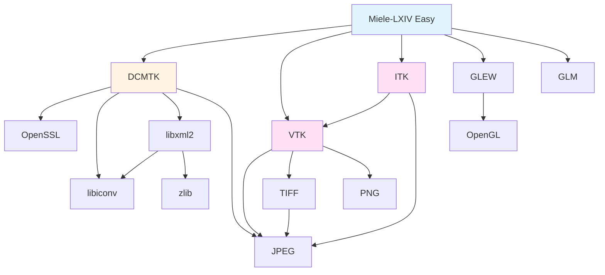

Miele-LXIV Easy manages a comprehensive set of medical imaging and graphics libraries. The build system automatically downloads, patches, configures, and compiles all dependencies to ensure compatibility and optimal performance.

## Dependency Categories

<CardGroup cols={2}>
  <Card title="DICOM Toolkit" icon="hospital" href="/dependencies/dcmtk">
    DCMTK handles all DICOM medical imaging operations including network communication, file parsing, and data manipulation.
  </Card>
  
  <Card title="3D Visualization" icon="cube" href="/dependencies/vtk-itk">
    VTK and ITK provide advanced 3D rendering, volume visualization, and medical image processing capabilities.
  </Card>
  
  <Card title="Image Formats" icon="image" href="/dependencies/image-libraries">
    JPEG, TIFF, PNG, OpenJPEG, and Jasper libraries handle various medical and standard image formats.
  </Card>
  
  <Card title="Graphics" icon="video" href="/dependencies/opengl">
    GLEW and GLM enable hardware-accelerated OpenGL rendering for smooth 3D visualization.
  </Card>
</CardGroup>

## Why These Dependencies?

Medical imaging applications require specialized libraries that standard development environments don't provide:

### DICOM Support
DCMTK is the industry-standard toolkit for working with DICOM medical images. It provides network protocols (C-STORE, C-FIND, C-MOVE) and comprehensive parsing of DICOM files.

### Advanced Visualization
Medical images often come in 3D volumes (CT, MRI scans). VTK provides the rendering pipeline, while ITK offers sophisticated image processing algorithms like segmentation and registration.

### Multiple Image Formats
Medical imaging uses various compression formats:
- **JPEG/JPEG-LS**: Lossy and lossless compression
- **JPEG 2000**: Advanced compression via OpenJPEG and Jasper
- **TIFF**: Multi-page image storage
- **PNG**: Lossless compression for displays

### Hardware Acceleration
Modern graphics cards dramatically improve rendering performance. GLEW provides access to OpenGL extensions, while GLM offers GPU-optimized math operations.

## Dependency Relationships

## Build System Integration

The build system handles dependencies in this order:

1. **Base Libraries**: zlib, libiconv, OpenSSL
2. **Image Libraries**: JPEG, PNG, TIFF, OpenJPEG, Jasper
3. **XML Support**: libxml2
4. **3D Visualization**: VTK → ITK (ITK depends on VTK)
5. **DICOM**: DCMTK (uses all image libraries)
6. **Graphics**: GLEW, GLM

<Info>
The build order is critical because later libraries depend on earlier ones. The build system automatically manages these dependencies.
</Info>

## Library Collapsing

To simplify linking, the build system collapses multiple static libraries into single archives:

- **libVTK.a**: Combines 100+ VTK component libraries
- **libITK.a**: Combines 200+ ITK module libraries  
- **libDCMTK.a**: Combines all DCMTK module libraries

This reduces Xcode project complexity and improves link times.

## Patching Strategy

Some libraries require patches for compatibility:

- **DCMTK**: Custom modifications for macOS and Miele-LXIV integration
- **OpenJPEG**: Build system and API adjustments

Patches are stored in the `patch/` directory and automatically applied during the build process.

<Warning>
Never skip the patching step for DCMTK and OpenJPEG. The patches contain critical fixes required for proper operation.
</Warning>

## Version Management

All library versions are defined in version configuration files (e.g., `version-set-8.8.conf`). This ensures:

- **Reproducible builds**: Same versions across all developers
- **Tested combinations**: Library versions are validated together
- **Easy updates**: Change versions in one place

## Next Steps

<CardGroup cols={2}>
  <Card title="DCMTK Details" icon="book-medical" href="/dependencies/dcmtk">
    Deep dive into DICOM toolkit configuration
  </Card>
  
  <Card title="Build Configuration" icon="gear" href="/reference/build-script">
    Learn how to configure the build system
  </Card>
</CardGroup>
