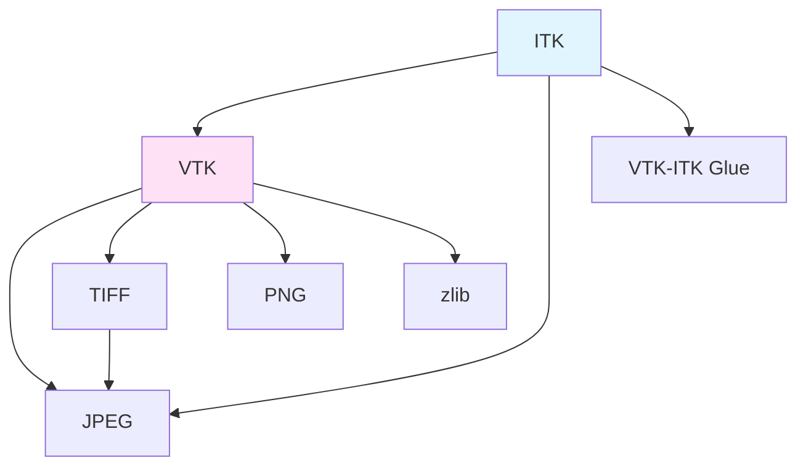

VTK (Visualization Toolkit) and ITK (Insight Segmentation and Registration Toolkit) are the core libraries enabling advanced 3D rendering and medical image processing in Miele-LXIV Easy.

## Overview

<CardGroup cols={2}>
  <Card title="VTK - Visualization" icon="cube">
    Handles 3D rendering, volume visualization, and graphics pipeline management
  </Card>
  
  <Card title="ITK - Processing" icon="wand-magic-sparkles">
    Provides medical image processing algorithms including segmentation and registration
  </Card>
</CardGroup>

## VTK (Visualization Toolkit)

### What is VTK?

VTK is an open-source software system for 3D computer graphics, image processing, and visualization. In medical imaging, it provides:

- **Volume Rendering**: Direct visualization of 3D medical image volumes
- **Surface Rendering**: Extracting and displaying 3D surfaces from medical data
- **2D/3D Graphics**: Multi-planar reconstruction (MPR) views
- **Interactive Widgets**: Tools for measuring, annotating, and manipulating images

### Version Configuration

<CodeGroup>
```bash Version (from version-set-8.8.conf)
VTK_MAJOR=9
VTK_MINOR=0
VTK_BUILD=1
VTK_VERSION=9.0.1
```

```bash Download
wget https://www.vtk.org/files/release/9.0/VTK-9.0.1.tar.gz
```
</CodeGroup>

### Build Configuration

VTK is configured with these important settings:

```bash build.sh:411-430
$CMAKE -G"$GENERATOR" \
    -D CMAKE_INSTALL_PREFIX=$BIN_VTK \
    -D CMAKE_OSX_ARCHITECTURES=$OSX_ARCHITECTURES \
    -D CMAKE_BUILD_TYPE=Release \
    -D CMAKE_OSX_DEPLOYMENT_TARGET=$DEPL_TARG \
    -D BUILD_SHARED_LIBS=OFF \
    -D BUILD_TESTING=OFF \
    -D BUILD_EXAMPLES=OFF \
    -D BUILD_DOCUMENTATION=OFF \
    -D VTK_LEGACY_REMOVE=OFF \
    $VTK_OPTIONS \
    -D VTK_USE_SYSTEM_TIFF=ON \
    -D VTK_USE_SYSTEM_JPEG=ON \
    -D VTK_MODULE_ENABLE_VTK_hdf5=NO \
    -D CMAKE_CXX_FLAGS="$COMPILER_FLAGS" \
    $SRC_VTK
```

#### Key VTK Options

| Option | Purpose |
|--------|--------|
| `VTK_RENDERING_BACKEND=OpenGL2` | Use modern OpenGL for hardware acceleration |
| `VTK_USE_SYSTEM_TIFF=ON` | Use our compiled TIFF library |
| `VTK_USE_SYSTEM_JPEG=ON` | Use our compiled JPEG library |
| `VTK_LEGACY_REMOVE=OFF` | Keep legacy APIs for compatibility |
| `BUILD_SHARED_LIBS=OFF` | Build static libraries |

<Info>
VTK includes bundled versions of TIFF and JPEG, but we use our own compiled versions to ensure consistency across all libraries.
</Info>

### VTK Modules

VTK is modular. Key modules used by Miele-LXIV include:

- **VTK::CommonCore**: Basic data structures
- **VTK::RenderingCore**: Rendering pipeline
- **VTK::RenderingOpenGL2**: OpenGL implementation
- **VTK::RenderingVolume**: Volume rendering
- **VTK::InteractionWidgets**: Interactive tools
- **VTK::IOImage**: Image file I/O

### Library Collapsing

VTK produces over 100 individual library files. The build system collapses them into a single archive:

```bash build.sh:449-458
if [ $STEP_COLLAPSE_VTK ] ; then
cd $BIN_VTK
VTK_COLLAPSED=lib/libVTK.a
if [ ! -f $VTK_COLLAPSED ] ; then
    echo "=== Collapse VTK into a single library"
    ARGS=$(find lib -name '*.a' -type f)
    libtool -static -v -o $VTK_COLLAPSED $ARGS
fi
fi
```

This creates `libVTK.a`, combining all VTK modules into one file for easier linking.

<Note>
The collapsed library can be quite large (500+ MB) because it includes all rendering, filtering, and I/O modules.
</Note>

## ITK (Insight Toolkit)

### What is ITK?

ITK is an open-source toolkit for medical image analysis. It provides:

- **Image Segmentation**: Identifying regions of interest in medical images
- **Image Registration**: Aligning images from different time points or modalities
- **Image Filtering**: Noise reduction, edge detection, morphological operations
- **Statistical Analysis**: Quantitative measurements from images

### Version Configuration

<CodeGroup>
```bash Version (from version-set-8.8.conf)
ITK_MAJOR=5
ITK_MINOR=1
ITK_BUILD=1
ITK_VERSION=5.1.1
```

```bash Download
wget https://github.com/InsightSoftwareConsortium/ITK/releases/download/v5.1.1/InsightToolkit-5.1.1.tar.gz
```
</CodeGroup>

### Build Configuration

ITK depends on VTK and is configured after VTK is built:

```bash build.sh:479-495
$CMAKE -G"$GENERATOR" \
    -D CMAKE_INSTALL_PREFIX=$BIN_ITK \
    -D CMAKE_OSX_ARCHITECTURES=$OSX_ARCHITECTURES \
    -D CMAKE_BUILD_TYPE=Release \
    -D CMAKE_OSX_DEPLOYMENT_TARGET=$DEPL_TARG \
    -D BUILD_SHARED_LIBS=OFF \
    -D BUILD_TESTING=OFF \
    -D BUILD_EXAMPLES=OFF \
    -D Module_ITKOpenJPEG=OFF \
    -D Module_ITKVtkGlue=ON \
    -D VTK_DIR=$BIN_VTK/lib/cmake/vtk-9.0 \
    -D CMAKE_CXX_FLAGS="$COMPILER_FLAGS" \
    $SRC_ITK
```

#### Key ITK Options

| Option | Purpose |
|--------|--------|
| `Module_ITKVtkGlue=ON` | Enable ITK-VTK integration |
| `Module_ITKOpenJPEG=OFF` | Use our OpenJPEG build instead |
| `VTK_DIR` | Point to VTK installation for integration |
| `BUILD_SHARED_LIBS=OFF` | Build static libraries |

<Info>
The `ITKVtkGlue` module is critical - it allows ITK to convert its image data structures to VTK formats for visualization.
</Info>

### ITK Modules

ITK has a modular architecture with 200+ modules. Key modules include:

- **ITKCommon**: Core data structures and algorithms
- **ITKIOImageBase**: Image file I/O
- **ITKImageFilterBase**: Basic filtering operations
- **ITKSegmentation**: Segmentation algorithms
- **ITKRegistration**: Image registration methods
- **ITKVtkGlue**: VTK integration

### Library Collapsing

Like VTK, ITK produces many individual libraries:

```bash build.sh:510-519
if [ $STEP_COLLAPSE_ITK ] ; then
cd $BIN_ITK
ITK_COLLAPSED=lib/libITK.a
if [ ! -f $ITK_COLLAPSED ] ; then
    echo "=== Collapse ITK into a single library"
    ARGS=$(find lib -name '*.a' -type f)
    libtool -static -v -o $ITK_COLLAPSED $ARGS
fi
fi
```

This creates `libITK.a`, combining all ITK modules.

## VTK-ITK Integration

VTK and ITK work together in Miele-LXIV:


### Workflow Example

1. **ITK loads** a DICOM series into an `itk::Image`
2. **ITK processes** the image (e.g., applies filters, performs segmentation)
3. **ITKVtkGlue** converts the ITK image to a `vtkImageData`
4. **VTK renders** the image using volume rendering or surface extraction
5. **User interacts** with the visualization through VTK widgets

## Build Time Considerations

<Warning>
**Build Time**: VTK and ITK are large projects that take significant time to compile:
- VTK: 30-60 minutes on modern hardware
- ITK: 45-90 minutes on modern hardware

Plan accordingly and ensure you have sufficient disk space (10+ GB for build artifacts).
</Warning>

### Parallel Building

The build script uses all available CPU cores:

```bash build.sh:118
MAKE_FLAGS="-j $(sysctl -n hw.ncpu)"
```

This significantly reduces build time on multi-core systems.

## Dependencies

Both VTK and ITK depend on image format libraries:



## Configuration in Kconfig

```kconfig Kconfig-miele:41-48
config DOWNLOAD_SOURCES_VTK
    bool "VTK"
    default y

config DOWNLOAD_SOURCES_ITK
    bool "ITK"
    default y
```

```kconfig Kconfig-miele:243-259
config COMPILE_VTK
    bool "Build VTK"
    default y

config COLLAPSE_VTK
    bool "Single VTK library"
    default y
    depends on COMPILE_VTK

config BUILD_ITK
    bool "Build ITK"
    default y

config COLLAPSE_ITK
    bool "Single ITK library"
    default y
    depends on BUILD_ITK
```

## Common Use Cases in Medical Imaging

### Volume Rendering (VTK)
```cpp
vtkSmartPointer<vtkVolume> volume = vtkSmartPointer<vtkVolume>::New();
vtkSmartPointer<vtkVolumeRayCastMapper> mapper = 
    vtkSmartPointer<vtkVolumeRayCastMapper>::New();
mapper->SetInputData(imageData);
volume->SetMapper(mapper);
```

### Image Filtering (ITK)
```cpp
using FilterType = itk::MedianImageFilter<ImageType, ImageType>;
FilterType::Pointer filter = FilterType::New();
filter->SetInput(inputImage);
filter->SetRadius(2);
filter->Update();
```

### ITK to VTK Conversion
```cpp
using ConverterType = itk::ImageToVTKImageFilter<ITKImageType>;
ConverterType::Pointer converter = ConverterType::New();
converter->SetInput(itkImage);
converter->Update();
vtkImageData* vtkImage = converter->GetOutput();
```

## Further Reading

<CardGroup cols={2}>
  <Card title="VTK Documentation" icon="globe" href="https://vtk.org/documentation/">
    Official VTK guides and API reference
  </Card>
  
  <Card title="ITK Software Guide" icon="book" href="https://itk.org/ItkSoftwareGuide.pdf">
    Comprehensive ITK textbook (PDF)
  </Card>
  
  <Card title="VTK Examples" icon="code" href="https://kitware.github.io/vtk-examples/">
    Hundreds of VTK code examples
  </Card>
  
  <Card title="ITK Examples" icon="code" href="https://itk.org/ITKExamples/">
    ITK example code and tutorials
  </Card>
</CardGroup>
